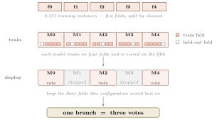

# ChildSafeAds 2026 — System Design Report

**Team Nürnberg NLP** · ChildSafeAds Shared Task @ [NLLP](https://nllpw.org/), EMNLP 2026 · Codabench account `broxy`

Nine models vote on every instance. They are picked to be **structurally dissimilar** —
different class scope, different training method, different backbone — on the assumption
that models built differently fail differently, so a majority over them is more robust than
any single one.

**Sections 1–5** describe how a voter is built and how nine of them become a decision.
**Section 6** lists what we submitted, **7** what those systems cost to run and **8** what
each level of data access buys — the question the task is built around. **9** collects what
went wrong and what our numbers cannot tell you; **10** states what this repository leaves
out and why.

No task data here; see [DATA.md](DATA.md) for licence and ethics terms.

### Contents

| Section | What it covers |
|---|---|
| **[1 · Class scope](#1--class-scope)** | which labels a voter is trained on: generalist, specialist, minority-class specialist |
| **[2 · Adaptation methods](#2--adaptation-methods)** | what is trained: generative, head on a tuned backbone, head on a frozen one, prompt only |
| **[3 · Models and naming](#3--models-and-naming)** | the four backbones, and how to read a configuration's name |
| **[4 · Cross-validation and branches](#4--cross-validation-and-branches)** | five channel-disjoint folds per configuration; the best three become a branch |
| **[5 · The nine-voter ensemble](#5--the-nine-voter-ensemble)** | three dissimilar branches, plain strict majority, and the taxonomy rules on top |
| **[6 · Submitted systems](#6--submitted-systems)** | what each submission contains, and the results table |
| **[7 · What it costs to run](#7--what-it-costs-to-run)** | seconds per segment and GPU-hours per corpus, measured |
| **[8 · What each data level buys](#8--what-each-data-level-buys)** | the level ladder read against collection cost |
| **[9 · Negative results and limits](#9--negative-results-and-limits)** | a truncation bug found by audit, two things that did not work, and what our numbers cannot settle |
| **[10 · Scope and ethics](#10--scope-and-ethics)** | what this repository deliberately does not contain |

---

## 1 · Class scope

Which training data a voter sees. Three scopes, three different failure modes.

<p align="center"></p>

**Generalist (G)** trains jointly on all three subtasks; the prompt selects the subtask at
inference. **Specialist (S)** trains on one subtask only — on a par with the generalist in
accuracy, but with a different error profile the vote can use.

**Minority-class specialist (MCS)** trains on one subtask but not on all its labels: sort
the labels by frequency and drop from the top **until the dropped labels exceed 50 % of the
mass**. What remains is its label space. Removing the dominant classes frees capacity for
the rare ones — where macro-F1 is won.

| Subtask | dropped | MCS keeps |
|---|---|---|
| **ST1** | `physical_goods` 47 % + `digital_content_or_services` 46 % = **93 %** | 3 of 5 labels |
| **ST2** | `apps` 29 % + `hardware_electronics` 22 % = **51 %** | 10 of 12 |
| **ST3** | `misleading_claim` 54 % | 7 of 8 |

ST1 is single-label, so dropping a label drops its **instances**; ST2 and ST3 are
multi-label, so only the **label columns** go.

> An MCS is scored only on its own labels, so its cross-validation number sits on a
> different scale and must never be compared against a G or S branch.

---

## 2 · Adaptation methods

What is trained. These are the columns of the grid — **functional positions**, not method
names: what does the same thing on a decoder and on an encoder sits in the same column.

<p align="center"></p>

| Column | Decoder | Encoder | What it is |
|---|---|---|---|
| generative | `SFT` | — | Fine-tuned to **emit the label as text**. Encoders do not generate. |
| trained + head | `ClsHead` | `FT` | Decoder: two-layer head on the QLoRA-adapted model, focal loss, inverse-frequency weights. Encoder: full fine-tuning. |
| frozen base + head | `Base-LR` · `Base-ClsHead` | same | Untrained backbone frozen, embeddings cached once, LR or MLP on top. The cheapest voters. |
| frozen generalist + head | `SFTf-LR` · `SFTf-ClsHead` | `FTf-…` | The **trained G generalist** frozen, LR or MLP on its embeddings — its domain knowledge without a second training run. |
| prompted | `OPRO` | — | Optimised prompt, no training. The bar the trained methods must clear. |

Two things the naming hides:

- **The `f` means "frozen generalist".** These heads always sit on a **G** backbone; the
  scope in a name refers to the **head**, not the backbone under it.
- **An LR head is fitted per label independently**, so `…-LR-G` and `…-LR-S-stX` are *the
  same classifier* for that subtask — identical on 50 of 50 folds for `FTf-LR`. Using both
  as branches would be fake diversity.

<p align="center"></p>

*Each cell is one configuration's three-best-fold mean; grey is not trained, a yellow frame
means fewer than five folds are finished and the number is provisional.*

---

## 3 · Models and naming

Two model families, because they fail differently: decoders can be tuned generatively,
encoders cannot generate but are structurally better at classification.

| | model | size | role |
|---|---|---|---|
| decoder | [Ministral-8B](https://huggingface.co/mistralai/Ministral-8B-Instruct-2410) | 8 B | 4-bit QLoRA |
| decoder | [Phi-4](https://huggingface.co/microsoft/phi-4) | 14 B | 4-bit QLoRA |
| encoder | [ettin-encoder-1b](https://huggingface.co/jhu-clsp/ettin-encoder-1b) | 1 B | full fine-tuning |
| encoder | [EuroBERT-610m](https://huggingface.co/EuroBERT/EuroBERT-610m) | 610 M | full fine-tuning |

A configuration's name states the three axes plus the data it may read:

```
        phi4  -  SFTf-LR  -  MCS-st3  -  L1234
        ────     ───────     ───────     ─────
        model    method      scope       levels
```

`G` needs no subtask; `S` and `MCS` name theirs. `L1234` is everything, `L1` the transcript
alone. The axis labels in the grid above read the same way.

---

## 4 · Cross-validation and branches

Every configuration is trained **five times**. The training split is cut into five folds
**f0–f4** grouped by channel — segments from one creator share vocabulary, product mix and
disclosure habits, so a random split leaks all of it. Run *i* trains on the four folds other
than **f**$_i$ and is scored on **f**$_i$, giving model **M**$_i$.

A **voter** is one such fold-model; its score on its own held-out fold is its $F1_{cv}$.
Ranking the five by $F1_{cv}$ and keeping the **top three** does two things: their mean
becomes the configuration's selection signal, and those three fold-models are what gets
deployed. The weaker two would add correlated noise, not an independent opinion. The three
together are a **branch**, and a branch casts three votes.

<p align="center"></p>

---

## 5 · The nine-voter ensemble

One branch is one opinion sampled three times — three voters of the same configuration
agree too often to arbitrate anything. The vote works because the three branches are
**structurally dissimilar**: different class scope (§1), in practice also different method
and backbone (§2), so their mistakes differ.

An **ensemble** is three branches — one **G**, one **S**, one **MCS** — nine voters,
deciding by **plain strict majority**: a label fires when more than half the votes cast
carry it.

<p align="center"></p>

**Fold coverage.** The three fold sets together cover all five folds, so no slice of the
training data goes unused.

**Voting rules.** ST1 breaks ties toward the majority class and never predicts `other`
(0.07 % of the corpus — under a macro-F1 averaging over *occurring* labels, an absent class
costs twice). ST2 is never empty. ST3 enforces the taxonomy: `no_flag` and
`insufficient_context` are exclusive against any real flag, and `undisclosed_advertising` /
`inadequate_disclosure` are mutually exclusive. The official checker tests neither of the
last two; ours does.

**Why an MCS cannot do harm.** It holds three of nine votes and never predicts the majority
labels. While G and S agree on one they already have six votes and win; the MCS moves the
decision only once they split — the uncertain cases. The gate is emergent, no threshold
needed.

---

## 6 · Submitted systems

Five submissions are allowed. Each fills the same three slots per subtask — one **G**, one
**S**, one **MCS** — and which model or method fills which slot is free.

### Submission 1

| | **G** | **S** | **MCS** |
|---|---|---|---|
| **ST1** | Phi-4 · SFT · L1234 | ettin-1b · FT · L1234 | Phi-4 frozen + LR · **L1** |
| **ST2** | Phi-4 · SFT · L1234 | ettin-1b · FT · L1234 | Phi-4 frozen + LR · L1234 |
| **ST3** | Phi-4 · SFT · L1234 | ettin-1b · FT · L1234 | Phi-4 frozen + LR · L1234 |

Two backbones carry all 27 fold-models. Trained on the training split alone. Eight of the
nine voters read L1234; the ST1 minority specialist reads the transcript alone.

### Submission 2

A different selection principle, same voting rules: per subtask, the trio with the best
**mean three-best-fold cross-validation score**, under a diversity constraint — at least
two backbones, one generative and one head-based branch per trio. The fixed G/S/MCS
slotting is dropped; what survives selection is mostly specialists.

| | Branch 1 | Branch 2 | Branch 3 |
|---|---|---|---|
| **ST1** | Phi-4 · SFT · L1234 | Ministral · head · L1234 | Ministral · head · L1234 |
| **ST2** | Ministral · head · L1234 | Phi-4 · head · L1234 | Phi-4 · SFT · L1234 |
| **ST3** | Phi-4 frozen + LR · L123 | Phi-4 · SFT generalist · L1234 | ettin-1b frozen + head · L12 |

Trained on the training split alone; the development set was read once afterwards as a
transfer check. Unlike Submission 1, the nine voters share no backbone passes at
inference — the diversity that helps the vote is paid for at run time (Section 7).
Submitted on 16 August as team organisation **Nürnberg NLP**.

### Submissions 3–5

*To be filled as we submit. Planned: the train+dev refit, and a variant addressing the
rare ST1 classes.*

### Results

| # | System | Levels | **test mean** | ST1 | ST2 | ST3 | ST3-family |
|---|---|---|---|---|---|---|---|
| 1 | G × S × MCS, trained on train | 1–4 | *pending* | | | | |
| 2 | top-3-CV pick, diversity rule | 1–4 | *pending* | | | | |
| 3 | — | | | | | | |
| 4 | — | | | | | | |
| 5 | — | | | | | | |

Branches are chosen on cross-validation only; the development set is read once afterwards as
a transfer check, never as a selection criterion. Submission 1 reaches **0.7683** there.

---

## 7 · What it costs to run

What **one segment** costs. Each subtask runs nine voters, so its cost is what those nine
passes charge.

| Submission | ST1 | ST2 | ST3 | all 3,360 instances |
|---|---|---|---|---|
| **1** | **4.4 s** | **4.4 s** | **4.4 s** | **12.4 GPU-h** |
| 2 | ~20 s | ~22 s | ~19 s | **≈55–60 GPU-h** ¹ |
| 3 | — | — | — | — |
| 4 | — | — | — | — |
| 5 | — | — | — | — |

*Subtask columns are seconds per segment on one A100-80GB; the last column is the whole
corpus. Inference only. ¹ Submission 2 derived from measured single-pass wall times
(measurement of the remaining pass types in progress); its nine voters share no backbone
passes, which is why structural diversity costs roughly five times Submission 1. Decoding dominates — the generative branch costs five times a frozen
forward on the same backbone, so an operator who wants this cheaper replaces that branch,
not the large model.*

---

## 8 · What each data level buys

Four cumulative access levels, ordered by collection cost. **The grid was trained at every
level:** each of L1, L12, L123 and L1234 carries 170–174 complete configurations across all
four models and all nine methods, so the ladder compares like with like. Per rung we run the
same selection — best G, best S, best MCS by three-best-fold cross-validation, restricted to
voters reading no level above the cap — and score the resulting nine-voter system on the
development set.

| System | mean | ST1 | ST2 | ST3 | Δ |
|---|---|---|---|---|---|
| L1 — transcript only | 0.6103 | 0.6492 | 0.6013 | 0.5805 | — |
| ≤ L12 — + video context | 0.7292 | 0.7966 | 0.7214 | 0.6696 | **+0.119** |
| ≤ L123 — + channel | 0.7348 | 0.8181 | 0.7092 | 0.6770 | +0.006 |
| ≤ L1234 — + product page | **0.7675** | 0.8459 | 0.7795 | 0.6770 | +0.033 |

Against the median added tokens (L2 ≈ 290, L3 ≈ 7, L4 ≈ 375):

- **Level 2 is the whole game.** Title, description and the platform's paid-promotion flag
  buy +0.119 for about 290 tokens.
- **Level 3 is free and worthless.** Seven tokens, +0.006 — inside noise. Skip it.
- **Level 4 pays only on ST1 and ST2.** It says what is being sold; it does not help with
  compliance flags. **ST3 is saturated at L12.**

For an authority weighing crawl cost: fetch video metadata always, skip channel context,
fetch product pages only if commercial type and category matter.

*Caveat: the ladder was measured before the retraining in §9, so every rung sits on capped
inputs and L1 suffers most. The ordering has held in everything measured since, but the
exact gaps are not settled. Re-running it is the first thing we will add here.*

---

## 9 · Negative results and limits

- **Input truncation.** Our first wave silently cut **16.9 % of product pages** and 7.2 % of
  descriptions, with the truncation side differing between training and inference. Found by
  auditing token lengths, not by seeing a bad score. Measure your truncation before trusting
  a level ablation.
- **Data augmentation did nothing.** Paired over 68 recipes: +0.007, inside noise. Dropped.
- **Prompting has a ceiling well below training.** OPRO reached ST2 0.59 against 0.89, ST3
  0.53 against 0.67.

What our numbers cannot settle:

- **The development set is small and noisy.** Split in half and correlated across
  configurations, its halves agree at *r* = 0.06 (ST1), 0.03 (ST2) and 0.37 (ST3). Differences
  below roughly 0.03 there are noise, which is why we never select on it.
- **An MCS on ST1 rests on few points.** After the majority classes are removed only about
  31 validation instances per fold remain, so its ranking is unstable even where its score
  looks high.

---

## 10 · Scope and ethics

This repository documents the system. It contains no task data, no per-instance predictions
(they are tied to identifiable channels) and no trained adapter weights. Curated source for
the metric, the voting rules, the split builder and the selection scripts follows after one
pass of cleaning.

**Bonus track:** not attempted. **Legal material:** only the citations shipped in
`legal_provisions.json`.

The compliance labels are a **research benchmark, not legal advice and not a finding of
unlawfulness**. We do not re-identify creators, do not contact them, and report no result
marking an individual creator as non-compliant. All figures are aggregate. See
[DATA.md](DATA.md).
