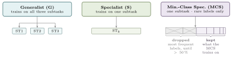
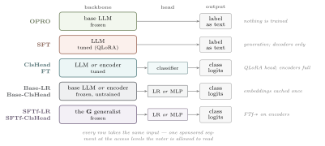
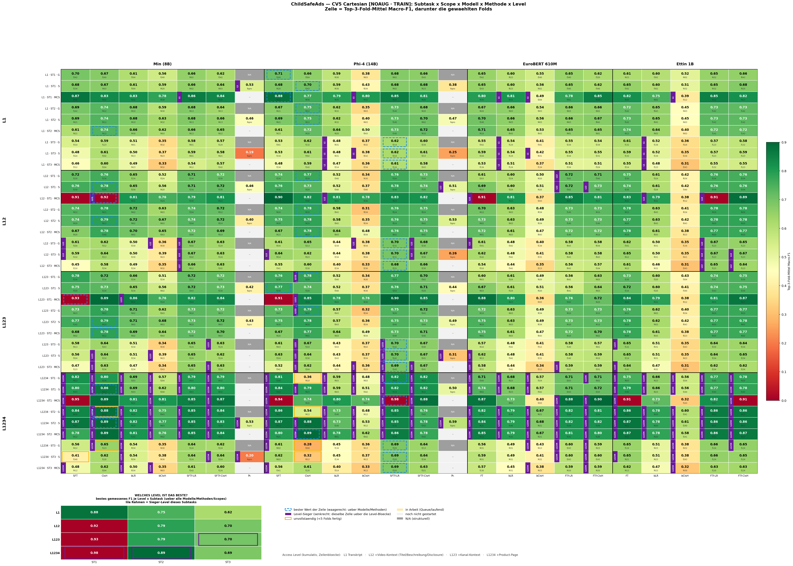
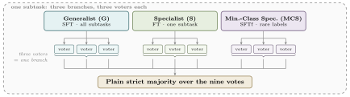

# ChildSafeAds 2026 — System Design Report

**Team Nürnberg NLP** · ChildSafeAds Shared Task @ [NLLP](https://nllpw.org/), EMNLP 2026 · Codabench account `broxy`

Our system is an ensemble of error-independent voters, built on the design we used for
GermEval 2026 and PsyDefDetect. Every voter is one point in a grid spanned by three axes:
**which model**, **which adaptation method**, and **which class scope** it trains on. This
report introduces the three axes first, then the ensemble that assembles them, then the
concrete system we submitted.

It contains **no task data** — see [DATA.md](DATA.md) for the licence and ethics terms.

---

## 1 · Class scope: what a voter is allowed to learn

The scope axis decides **which training data a voter sees**. It carries the main idea of
the system: three scopes, three different strengths, three different failure modes.

**Generalist (G).** Trains jointly on all three subtasks in a multi-task setup. The shared
signal is meant to build broad domain knowledge — patterns common to the subtasks that no
single one provides alone. Evaluation runs one subtask at a time, so the generalist carries
a subtask switch: the prepended prompt selects the subtask at inference.

**Specialist (S).** Trains only on the data of a single subtask. The narrowed signal fits
that subtask's label set more tightly. In practice it performs on a par with the
generalist; what it mainly contributes is a **different error profile** the vote can use.

**Minority-class specialist (MCS).** Like a specialist, it trains on **one subtask** — but
not on all of that subtask's labels. Sort the labels by frequency and drop them from the
top, one after another, **until the dropped labels together exceed 50 % of the mass**.
Everything below that cut is the MCS's label space, and it never sees the rest.

| Subtask | removed (cumulative share) | MCS trains on |
|---|---|---|
| **ST1** | `physical_goods` 47 % + `digital_content_or_services` 46 % = **93 %** | `physical_services`, `none`, `other` |
| **ST2** | `apps` 29 % + `hardware_electronics` 22 % = **51 %** | the remaining 10 categories |
| **ST3** | `misleading_claim` 54 % | the remaining 7 flags |

Because ST1 is single-label, removing a label removes its **instances** from training and
validation. ST2 and ST3 are multi-label, so only the **label columns** are dropped and the
instances stay.

Removing the dominant classes is meant to shift the model's errors elsewhere and free its
capacity for the fine distinctions between the rare classes — the ones a compliance
monitor actually cares about and where macro-F1 is won.

> **Reading MCS scores.** An MCS is scored only on its own labels, so its cross-validation
> number sits on a different scale and must never be compared directly against a G or S
> branch. On ST1 in particular, a full-label evaluation of an MCS is meaningless: it can
> never hit the two classes covering 93 % of instances.

---

## 2 · Adaptation methods: how a voter is trained

The method axis decides **what is trained**. These are the columns of our search grid.
They are **functional positions**, not method names: what does the same thing on a decoder
and on an encoder sits in the same column, which is what makes the grid comparable across
model families.

| Column | Decoder | Encoder | What it is |
|---|---|---|---|
| generative | `SFT` | — | The model is fine-tuned to **emit the label as text** from a task prompt containing the full category definitions. Encoders do not generate, so this column is structurally empty for them. |
| trained + heads | `ClsHead` | `FT` | Decoder: a two-layer head on the last-token hidden state of the QLoRA-adapted model, trained with focal loss and inverse-frequency class weights. Encoder: **full** fine-tuning with heads. Same function, different mechanics. |
| frozen base + head | `Base-LR` | `Base-LR` | The **untrained** backbone is frozen, its embeddings cached once, and a logistic regression fitted on them. The cheapest voter in the pool. |
| | `Base-ClsHead` | `Base-ClsHead` | Same cached embeddings, MLP head instead of logistic regression. |
| frozen generalist + head | `SFTf-LR` | `FTf-LR` | The **trained G generalist** is frozen and a logistic regression fitted on its embeddings. It inherits the generalist's domain knowledge without a second training run. |
| | `SFTf-ClsHead` | `FTf-ClsHead` | Same, MLP head. |
| prompted | `OPRO` | — | Prompt optimised by OPRO, no training. The bar the trained methods have to clear. |

Two things are worth spelling out because the naming hides them:

- **The `f` in `SFTf` / `FTf` means "frozen generalist".** These heads always sit on a **G**
  backbone; the scope in a voter's name refers to the **head**, not the backbone. So
  `phi4-SFTf-LR-MCS-st3` is a minority-class logistic regression on a frozen Phi-4
  generalist.
- **A logistic-regression head is fitted per label independently.** As a consequence a
  `…-LR-G` and a `…-LR-S-stX` voter produce, for that subtask, *the same classifier*. We
  measured it: identical on 50 of 50 folds for `FTf-LR`. They must never be used as two
  branches of one ensemble — that would be fake diversity.

Each cell of the resulting grid is one configuration. This is what the search space looks
like once trained:

*Every cell is one configuration's three-best-fold mean. The three schematics above
are TikZ; sources are in [`figures/src/`](figures/src) and
`bash figures/src/build.sh` rebuilds them as PDF (for the paper) and SVG (for this
page).*

---

## 3 · The nine-voter ensemble

Three terms build the system from a single vote up.

A **voter** is one model, trained in one method on one class scope, on four of five folds
and evaluated on the held-out fifth that names it.

A **branch** is three voters sharing model, method and scope, differing only in which fold
each held out — **the three folds on which that configuration scored highest**. A branch
therefore casts three votes.

An **ensemble** is three branches — nine voters — deciding every instance by **plain strict
majority** (> 50 % of votes cast).

**Cross-validation.** Five folds over the training set, grouped by **channel**, with an
assertion that no channel appears in two folds. Sponsored segments from one creator share
vocabulary, product mix and disclosure habits; a random split leaks all of it. Each
configuration is trained five times, giving five per-fold macro-F1 scores; the **mean of
the three best** is its selection signal and names the three voters it deploys.

**Fold coverage.** The three fold sets are chosen so that **all five folds appear across
the nine voters**. No slice of the training data goes unused, and the out-of-fold estimate
covers every training instance rather than a convenient subset.

**Voting rules.** ST1 breaks ties toward the majority class and never predicts `other`
(0.07 % of the corpus — under a macro-F1 that averages over *occurring* labels, predicting
an absent class costs twice). ST2 is never empty. ST3 enforces the taxonomy: `no_flag` and
`insufficient_context` are exclusive against any real flag, and `undisclosed_advertising` /
`inadequate_disclosure` are mutually exclusive. The official checker does not test the last
two constraints; ours does.

**Why an MCS branch cannot do harm.** It contributes three of nine votes and never predicts
the majority labels. While the G and S branches agree on a majority label they already hold
six votes and win. The MCS can only move the decision once the other two split — the
uncertain cases where a sharper view of the rare classes helps. The gate is emergent; it
needs no threshold.

---

## 4 · Submission 1 — SFT × SFTf × FT

The scope assignment is fixed to **SFT = G, SFTf = MCS, FT = S**, and each slot takes its
best configuration by cross-validation. All nine voters read **L1234**.

| | **G** — SFT | **S** — FT | **MCS** — SFTf |
|---|---|---|---|
| **ST1** | `min` folds 4,2,3 | `ettin-1b` folds 2,4,0 | `min`-ClsHead folds 4,1,2 |
| **ST2** | `phi4` folds 4,2,0 | `ettin-1b` folds 4,1,2 | `min`-LR folds 2,4,3 |
| **ST3** | `phi4` folds 0,2,1 | `ettin-1b` folds 4,2,1 | `phi4`-LR folds 3,2,0 |

| | mean | ST1 | ST2 | ST3 |
|---|---|---|---|---|
| out-of-fold (train, 2,353 instances) | 0.6320 | 0.4804 | 0.8169 | 0.5988 |
| **development set** (504 instances) | **0.7675** | 0.8641 | 0.7549 | 0.6835 |
| test set (503 instances) | *pending* | | | |

The two internal numbers are on different scales. Out-of-fold, an instance is voted on only
by the branches whose deployed folds contain its held-out fold — **one to three votes**. On
dev, all nine fold-models vote on every instance, which is also the situation at test time.
Only the dev number is comparable to a leaderboard.

Dev was never used for selection (§5); it is a transfer check, read once after the
composition was frozen. Further systems will be added here as we submit them.

---

## 5 · Why selection never touches the development set

We measured the reliability of the development set by splitting it in half and correlating
the two halves across configurations:

| | ST1 | ST2 | ST3 |
|---|---|---|---|
| split-half correlation *r* | 0.06 | 0.03 | 0.37 |

With 504 instances, differences below roughly 0.03 on dev are noise. A search that ranks
candidates on dev fits that noise — and we could show it: freely searching fold-models
against dev produced systems that looked better on dev and were not.

**The metric is verified, not assumed.** The official scorer is not public, so we
reimplemented it and calibrated against the leaderboard: our local score matched the
returned score to four decimal places across every column (Δ = 0.0000).

---

## 6 · What each data level buys

The task ships four cumulative access levels ordered by collection cost. **The grid was
trained at every level, not just at the top:** each of L1, L12, L123 and L1234 carries
170–174 configurations with all five folds complete, spanning all four models and all nine
methods. The ladder therefore compares like with like rather than a full grid against a
thin one.

**How each rung is measured.** For a given cap we run the same selection as everywhere else
— best G, best S, best MCS by three-best-fold cross-validation — but restricted to voters
that read no level above the cap. The resulting nine-voter system is then scored **on the
development set**, which no voter has seen. So the ladder is a comparison of complete
systems at each data cost, not of individual voters.

| System | mean | ST1 | ST2 | ST3 | Δ over previous rung |
|---|---|---|---|---|---|
| L1 — transcript only | 0.6103 | 0.6492 | 0.6013 | 0.5805 | — |
| ≤ L12 — + video context | 0.7292 | 0.7966 | 0.7214 | 0.6696 | **+0.119** |
| ≤ L123 — + channel | 0.7348 | 0.8181 | 0.7092 | 0.6770 | +0.006 |
| ≤ L1234 — + product page | **0.7675** | 0.8459 | 0.7795 | 0.6770 | +0.033 |

Against the median added tokens per instance (L2 ≈ 290, L3 ≈ 7, L4 ≈ 375):

- **Level 2 is the whole game.** Title, description and the platform's own paid-promotion
  flag buy +0.119 for about 290 tokens. Nothing else comes close.
- **Level 3 is free and worthless.** The channel name costs seven tokens and moves the mean
  by +0.006, inside our noise band. A monitoring system can skip it.
- **Level 4 pays only on ST1 and ST2.** The product page says what is being sold and in
  which category. It does not help with compliance flags: **ST3 is saturated at L12**.

For an authority weighing crawl cost against accuracy: fetch video metadata always, skip
channel context, fetch product pages only if commercial type and product category matter.

Two caveats on the record. The ladder was measured before the full-text retraining
described in §7, so every rung sits on capped inputs; the L1 rung suffers most, because
its scaffold ate a larger share of a short sequence. The gaps are real and the ordering has
held up in everything we have measured since, but the exact sizes are not settled, and we
would not want the +0.119 quoted to three decimals. Re-running the ladder on the retrained
grid is the first thing we will add here.

---

## 7 · Negative results

- **Input truncation.** Our first training wave capped inputs at a sequence length that
  silently cut **16.9 % of product pages** and 7.2 % of descriptions, with the truncation
  side differing between training and inference. We found it by auditing token lengths, not
  by seeing a bad score. After verifying that all 3,360 instances fit in 8,192 tokens at
  every level, we retrained. Measure your truncation before trusting a level ablation.
- **Data augmentation did nothing.** Paired over 68 recipes it moved the mean by +0.007 —
  inside noise. Dropped.
- **Prompting has a ceiling well below training.** OPRO reached ST2 0.59 against 0.89 for a
  trained head, and ST3 0.53 against 0.67.

---

## 8 · Scope, reproducibility, ethics

This repository documents the system. It deliberately contains no task data, no
per-instance predictions (they are tied to identifiable channels), and no trained adapter
weights. Curated source for the metric implementation, the voting rules, the
channel-disjoint split builder and the selection scripts will be added after one pass of
cleaning — the working tree carries internal cluster paths and account names that do not
belong in public.

**Bonus track.** We did not collect off-platform destination data. **Legal material:** we
used only the citations shipped in `legal_provisions.json` and retrieved nothing beyond
them.

The compliance labels are a **research benchmark, not legal advice and not a finding of
unlawfulness**. We do not re-identify creators, do not contact them, and report no result
that would mark an individual creator as non-compliant. All figures here are aggregate.
See [DATA.md](DATA.md).
